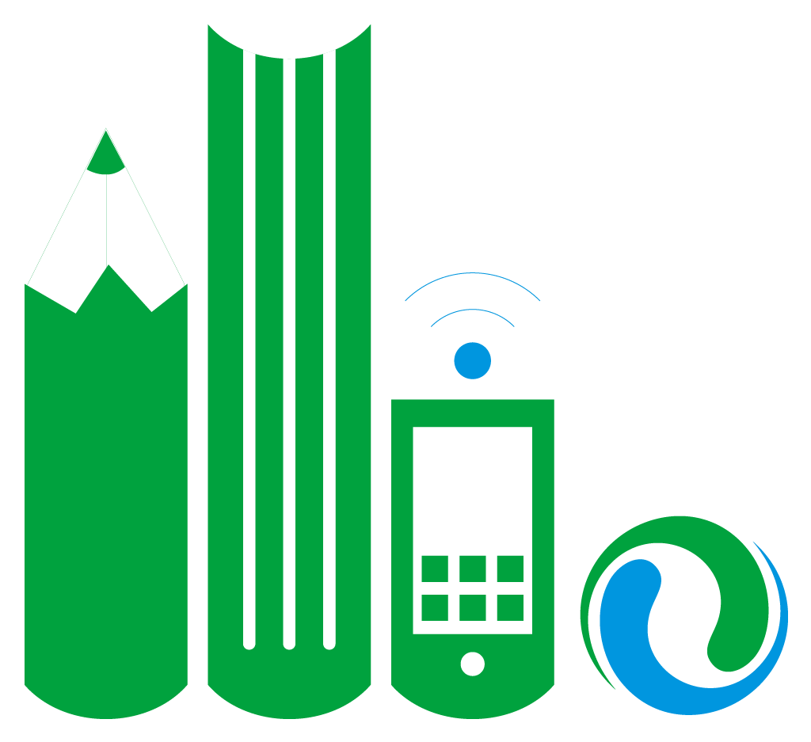

# 리터러시 트렌드 (literacytrends)

리터러시팩토리(릿팩)가 매주 뉴스·블로그에서 다뤄지는 "리터러시/문해력" 관련 담론을 모아 정리하는 위키입니다. [릿팩뉴스레터](https://litfac.stibee.com/)의 "리터러시 담론읽기" 섹션 원고를 원자료로 삼아, 리터러시 관련 주제와 개념을 누적 정리합니다.

**[→ 위키 바로 보기](https://github.com/youngwoolearning/literacytrends/blob/main/wiki/index.md)** — 호별 요약, 반복 주제·개념, 용어집을 한눈에 볼 수 있는 카탈로그입니다.

[저장소 바로가기](https://github.com/youngwoolearning/literacytrends)에서 원문 원고(`raw/`)도 확인할 수 있습니다.

## 만드는 방식

이 위키는 릿팩뉴스레터에 실렸던 글을 AI(LLM)의 도움을 받아 정리·갱신합니다. 원문 기사는 그대로 옮기지 않고 제목·매체명·링크로만 인용합니다.

Andrej Karpathy가 제안한 ["LLM Wiki"](https://gist.github.com/karpathy/442a6bf555914893e9891c11519de94f) 패턴을 따라, 소스를 읽을 때마다 위키 페이지를 계속 갱신해 지식이 누적되는 방식으로 운영합니다.

## 라이선스

이 저장소의 콘텐츠(raw/wiki 문서)는 [CC BY-NC-SA 4.0](https://github.com/youngwoolearning/literacytrends/blob/main/LICENSE)을 따릅니다. 출처(리터러시팩토리)를 밝히고 비영리 목적이라면 자유롭게 인용·공유할 수 있습니다.
